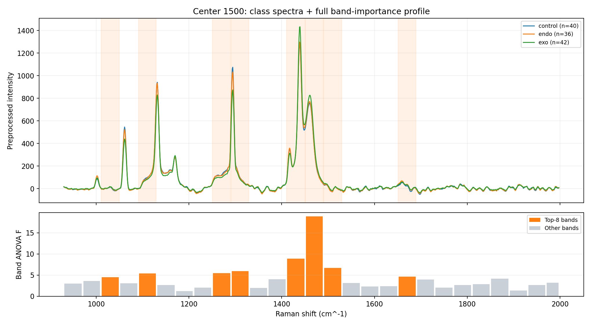
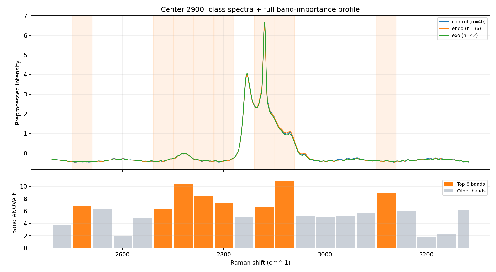
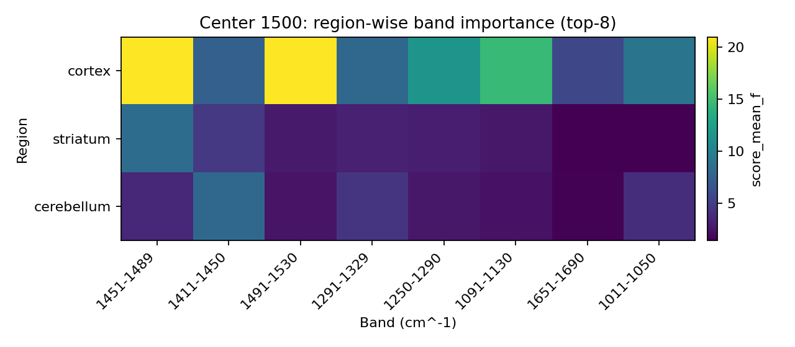
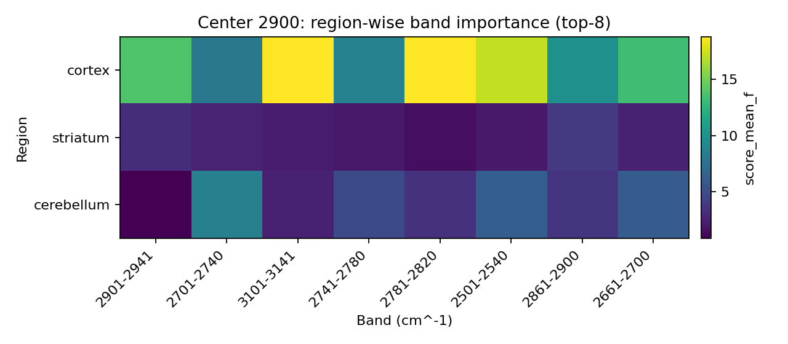

# Дополнительная Задача: Информативные Спектральные Области

## 1) Что требовалось

В дополнительной задаче нужно было проанализировать спектры и определить диапазоны (пики), которые сильнее всего помогают различать классы `control / endo / exo`.

## 2) Как мы это сделали

Мы решили это как отдельную интерпретационную задачу поверх обученного классификационного контура:

1. разделили ось `wave` на диапазоны фиксированной ширины;
2. для каждого диапазона посчитали, насколько хорошо он разделяет 3 класса;
3. ранжировали диапазоны по информативности;
4. визуализировали top-диапазоны отдельно для `center=1500` и `center=2900`.

Технически расчет сделан в модуле `src/raman_hack/interpretation/`, запуск — `scripts/run_inverse_task_v1.py`.

## 3) Что показывает метрика на графиках

На графиках используется `Band ANOVA F`.

Смысл:

1. чем сильнее диапазон различает средние значения между классами и чем меньше разброс внутри класса, тем выше `F`;
2. чем выше `F`, тем информативнее этот диапазон для различения классов.

Это метрика **вклада диапазона**, а не итоговая метрика качества классификатора.

## 4) Основные графики для презентации

Ниже 2 главных графика:

### 4.1 Центр 1500



### 4.2 Центр 2900



Дополнительно:





## 5) Выводы

1. В окне `1500` наиболее информативен кластер диапазонов около `1410-1530 cm^-1`, с максимумом в зоне `1451-1489`.
2. В окне `2900` информативны диапазоны около `2700-2820`, `2900-2941` и `3101-3141 cm^-1`; один из ключевых — `2901-2941`.
3. Region-aware анализ показывает, что сложность различения классов зависит от области мозга, поэтому раздельный анализ по регионам полезен и обоснован.

## 6) Артефакты, которые прикладываем

1. Графики из раздела выше (`spectrum_bandscore` для `1500` и `2900`).
2. Таблица информативности диапазонов:
   - `runs/analysis/inverse_task_smoke_readable_20260307/inverse_center_overall_band_scores.csv`
3. Region-aware таблица (опционально):
   - `runs/analysis/inverse_task_smoke_readable_20260307/inverse_center_region_band_scores.csv`

## 7) Воспроизводимость

```bash
.venv/bin/python scripts/run_inverse_task_v1.py \
  --config-1500 configs/experiment/p2_locked_holdout/p2lk_1500_ramannet_ss11.yaml \
  --config-2900 configs/experiment/p2_locked_holdout/p2lk_2900_trpatch8_ss11.yaml \
  --band-width 20 \
  --bootstrap 200 \
  --plot-top-k 10 \
  --out-dir runs/analysis/inverse_task_final_YYYYMMDD
```

Текущий пакет:
`runs/analysis/inverse_task_smoke_readable_20260307/`.
